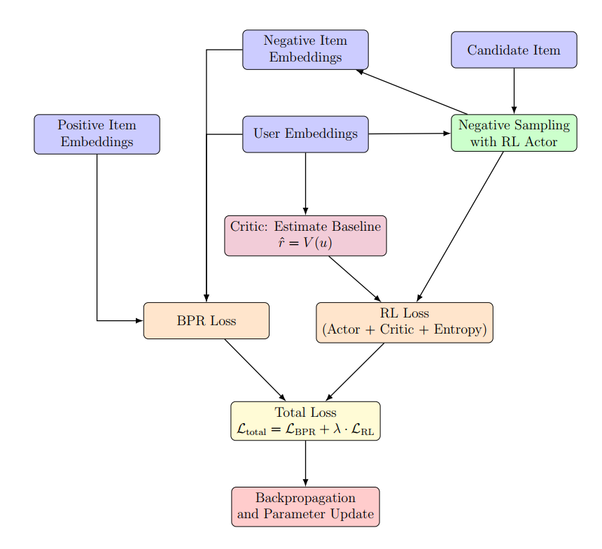
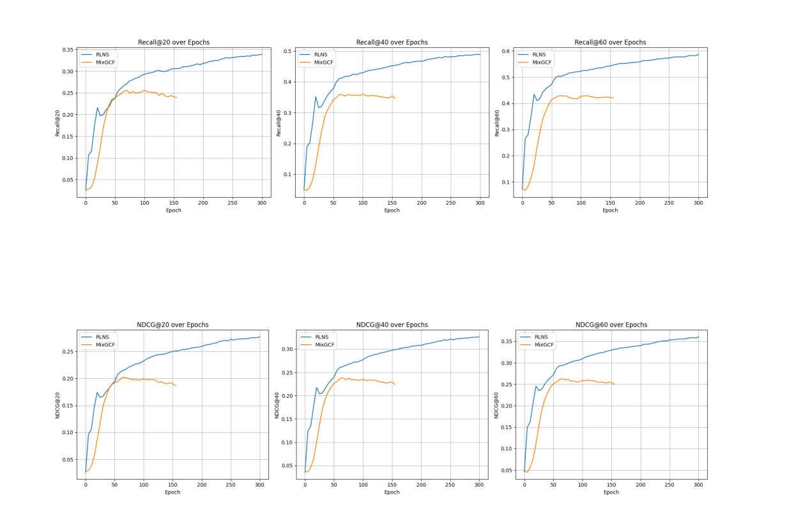

# RLNS - Reinforcement Learning Negative Sampling for GNN-based Recommender Systems

## Overview

RLNS is a recommendation system framework that combines **Graph Neural Networks (GNN)** and **Reinforcement Learning (RL)** to improve the negative sampling process in collaborative filtering tasks.

Traditional negative sampling methods such as random sampling or fixed hard negative sampling often lack flexibility and adaptability. RLNS introduces an RL-based agent that dynamically selects informative hard negative samples during training, helping the recommendation model learn more effectively.

This project focuses on improving recommendation performance for implicit feedback datasets using modern GNN architectures.

---

## Features

- Graph Neural Network based recommendation system
- Reinforcement Learning for adaptive negative sampling
- Dynamic hard negative sample selection
- Multi-head attention integration
- Evaluation with ranking metrics
- Support for large-scale recommendation datasets

---

## Architecture

The framework consists of:

1. User-item interaction graph construction
2. GNN-based embedding learning
3. RL agent for negative sample selection
4. Recommendation model optimization

### Main Components

- **GNN Models**
  - LightGCN
  - NGCF

- **RL Components**
  - State representation
  - Action selection
  - Reward mechanism

- **Attention Mechanism**
  - Multi-head attention for embedding aggregation

- **Workflow**
  
---

## Datasets

Experiments were conducted on benchmark datasets:

- Alibaba
- Yelp2018
- Amazon

---

## Evaluation Metrics

The model is evaluated using:

- Recall@K
- NDCG@K
- Precision@K
- Loss

---

## Results

RLNS demonstrates improved recommendation performance compared to traditional negative sampling methods such as:

- Random Negative Sampling (RNS)
- Dynamic Negative Sampling (DNS)
- MixGCF

| Dataset | Alibaba | Yelp2018 | Amazon | ml-100k* |
|---|---:|---:|---:|---:|
| Number of Users | 106,042 | 31,668 | 192,403 | 943 |
| Number of Items | 53,591 | 38,048 | 63,001 | 1,682 |
| Number of Interactions | 907,407 | 1,561,406 | 1,689,188 | 100,000 |
| Density | 0.00016 | 0.00130 | 0.00014 | 0.06312 |

  - **Comparision chart**

The proposed approach improves recommendation accuracy and training effectiveness by selecting more informative hard negative samples.

---

## Tech Stack

- Python
- PyTorch
- Graph Neural Networks
- Reinforcement Learning

---

## Project Structure

```bash
project/
│
├── data/               # Datasets
├── models/             # GNN and RL models
├── training/           # Training scripts
├── evaluation/         # Evaluation metrics
├── utils/              # Utility functions
├── configs/            # Configuration files
└── README.md
